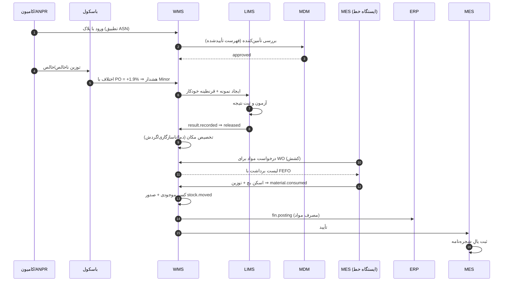
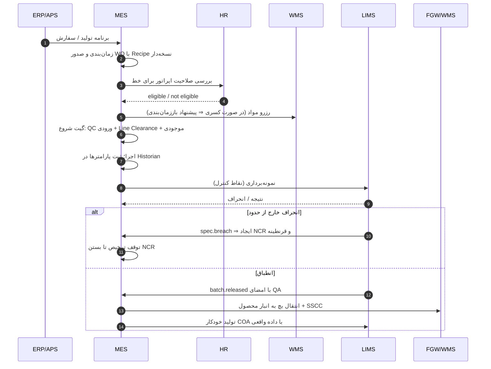
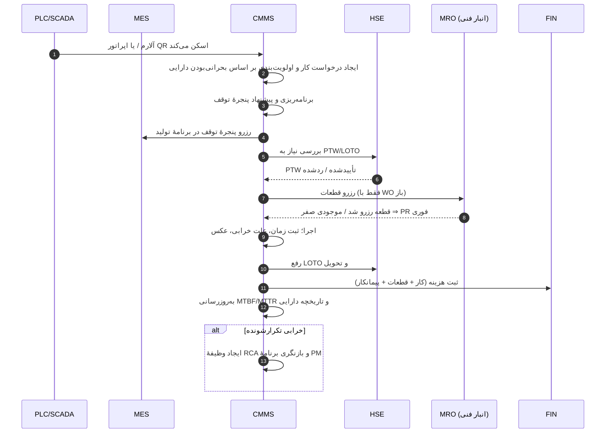
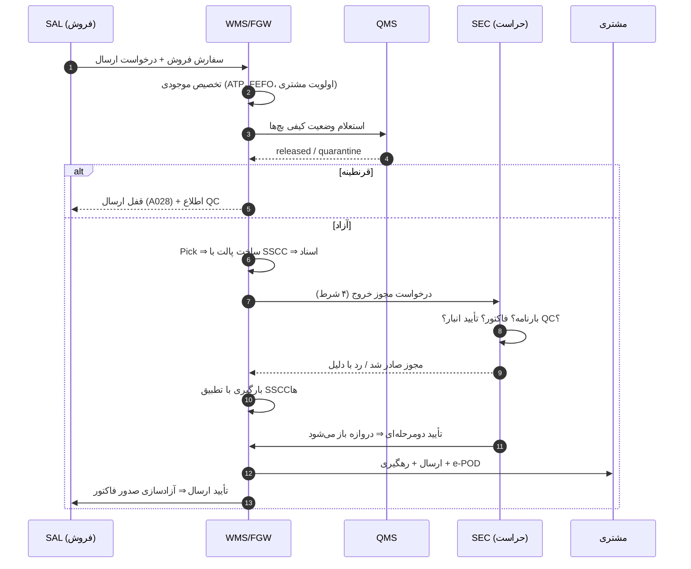
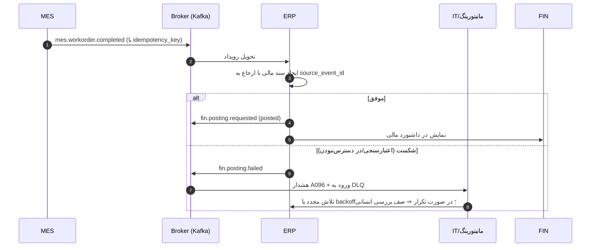
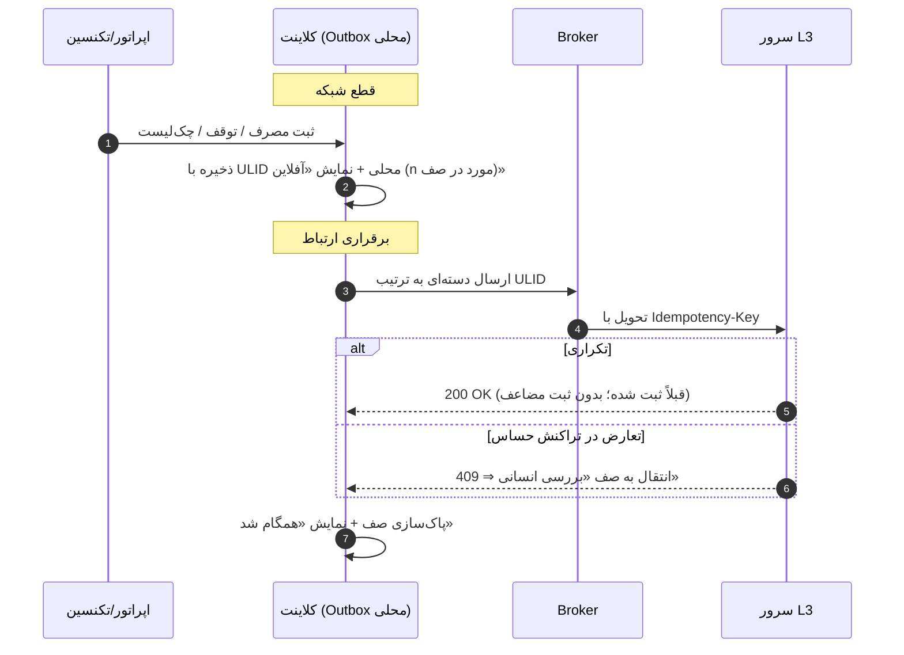
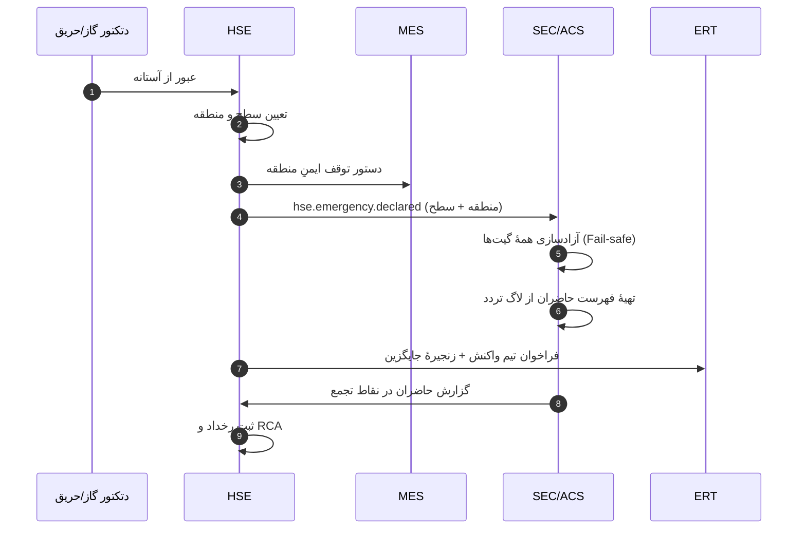

# ۲۱. سناریوهای توالیِ سرتاسری (Sequence Flows)

> این سند «تست‌نامهٔ زنده» ی پروژه است: هر جریان با دیاگرامِ توالی، مسیرِ شکست،
> و سناریوی UAT متناظر در [`13-uat-checklist.md`](13-uat-checklist.md) آمده است.
> دیاگرام‌ها با Mermaid نوشته شده‌اند و در GitHub نمایش داده می‌شوند.

---

## F1 — از دریافت مادهٔ اولیه تا مصرف در خط

### مسیر موفق

### مسیر شکست و جبران

| نقطهٔ شکست | رفتار سیستم | جبران |
|---|---|---|
| تأمین‌کننده خارج از فهرست تأییدشده | قفل ثبت رسید (`A036`) | ارجاع به کیفیت؛ تأیید استثنا با مستندات |
| انحراف وزن > ۱٪ | هشدار + الزام تأیید QC پیش از تخلیه (`A037`) | بررسی و تأیید یا مرجوعی |
| نتیجهٔ آزمون نامنطبق | قرنطینه + جلوگیری از برداشت (`A019`) | NCR و تصمیم (مرجوعی/استفادهٔ مشروط) |
| اسکن بچ اشتباه در خط | عدم پذیرش + نمایش بچ صحیح طبق FEFO | اسکنِ صحیح؛ دور زدن فقط با تأیید مستند |
| قطع شبکه در ایستگاه توزین | ثبت در Outbox محلی با ULID | همگام‌سازی با idempotency پس از اتصال |

**سناریوی UAT:** UAT-01 · **رویدادها:** `wms.receipt.created`، `qms.result.recorded`، `material.consumed`

---

## F2 — از صدور دستور کار تا ترخیص بچ

### مسیر موفق

### نقاط قفل و تصمیم

| گیت | شرط | نوع |
|---|---|---|
| شروع WO | تأیید QC ورودی + Line Clearance + موجودی کافی | سخت |
| اجرای Recipe | فقط نسخهٔ امضاشده | سخت |
| مصرف | بچ `released` + FEFO + تلورانس | سخت |
| ترخیص | امضای الکترونیکی QA + بسته‌شدن NCRهای باز | سخت |

**سناریوی UAT:** UAT-02، UAT-03 · **رویدادها:** `mes.workorder.started`، `qms.result.recorded`، `batch.released`

---

## F3 — از خرابی تجهیز تا بستن دستور کار نگهداشت

**نکتهٔ طراحی:** در این جریان، **هیچ کاری بدون PTW معتبر شروع نمی‌شود** (گیتِ سخت HSE).
اگر دارایی کلاس A باشد، نبود قطعه ⇒ PR فوری با هشدار `A040`.

**سناریوی UAT:** UAT-06 · **رویدادها:** `cmms.workorder.created`، `hse.ptw.approved`، `cmms.workorder.completed`

---

## F4 — خروج کالا از کارخانه (چهار شرط + تأیید دوگانه)

**تستِ منفیِ الزامی:** حذف هر یک از چهار شرط باید منجر به **باز نشدن دروازه** شود
(این چهار حالت باید در UAT-08 یکی‌یکی اجرا و در Audit ثبت شوند).

---

## F5 — رویداد مالی خودکار و جبران (Saga)

**قواعد جبران:** سند مالی هرگز «ویرایشِ درجا» نمی‌شود؛ اصلاح با **سند معکوس + سند صحیح** است،
هر دو با ارجاع به رویداد مبدأ. این کار ردیابی از صورت مالی تا رکورد سنسور را حفظ می‌کند.

---

## F6 — حالت آفلاین در کارگاه

**آستانه‌ها:** سقف آفلاین ۷۲ ساعت · نمایشِ دائمیِ وضعیت اتصال ·
برای کیفیت/ایمنی، حلِ تعارض با «آخرین نویسنده برنده» ممنوع.

---

## F7 — وضعیت اضطراری و تخلیه

**الزام زمانی:** از تشخیص تا آزادسازی گیت‌ها ≤ ۳۰ ثانیه (سناریوی UAT-11).

---

## ۲۱-۱. ماتریس سناریو → تست پذیرش → شاخص

| جریان | سناریوی UAT | شاخصِ پایش | آلارم‌های مرتبط |
|---|---|---|---|
| F1 ماده تا مصرف | UAT-01 | `K022` دقت موجودی، `K013` انحراف مصرف | `A019`، `A035`، `A036` |
| F2 تولید تا ترخیص | UAT-02، UAT-03 | `K001` OEE، `K004` FPY، `K014` زمان ترخیص | `A014`، `A015`، `A023` |
| F3 خرابی تا بستن WO | UAT-06 | `K050` PM به‌موقع، `K048` MTTR | `A045`، `A050` |
| F4 خروج کالا | UAT-04، UAT-08 | `K030` OTIF، `K033` دقت ارسال | `A028`، `A029`، `A078` |
| F5 رویداد مالی | UAT-09 | `K111` اسناد خودکار، `K109` دقت بها | `A096` |
| F6 آفلاین | UAT-10 | — | `A104` |
| F7 اضطرار | UAT-11 | `K085` زمان پاسخ | `A001`، `A003`، `A002` |

---

← بعدی: [`22-vendor-selection.md`](22-vendor-selection.md)
